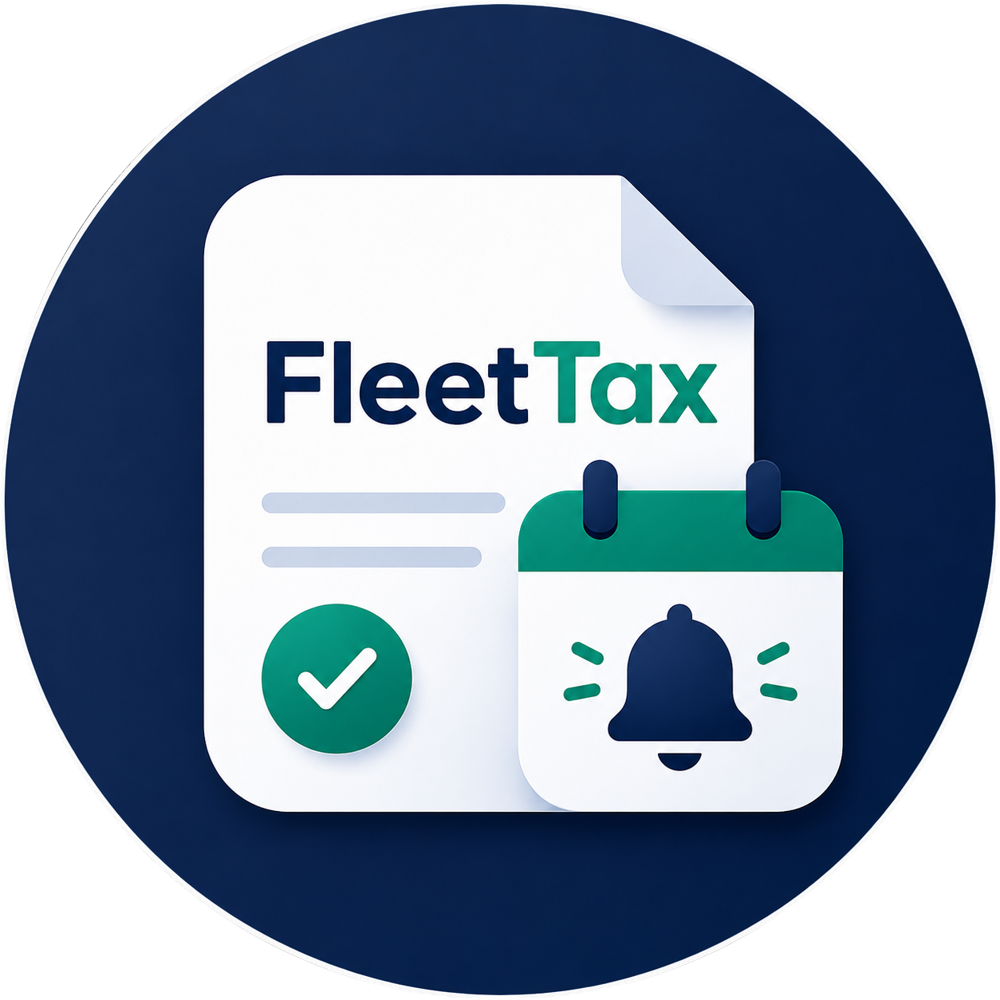

<div align="center">



# FleetTax

**Offline Vahan road tax tracking for Indian bus and truck fleets.**

[](https://flutter.dev)
[](https://dart.dev)
[](https://developer.android.com)
[](LICENSE)
[](https://github.com/DevanshSrajput/FleetTax/releases)

[Website](https://devanshsrajput.github.io/FleetTax/) |
[Documentation](https://devanshsrajput.github.io/FleetTax/docs.html) |
[PDF Guide](docs/FleetTax_Documentation.pdf) |
[Releases](https://github.com/DevanshSrajput/FleetTax/releases)

</div>

---

## Overview

FleetTax is a Flutter Android app for fleet owners who need a simple way to
track Vahan road tax deadlines for buses and trucks. It stores vehicle data
locally, calculates expiry dates automatically, highlights urgent renewals, and
opens the Vahan portal when it is time to pay.

The app is built around a practical daily workflow:

1. Add a bus or truck with its registration number and tax period.
2. Review the dashboard for expired, due-soon, and valid vehicles.
3. Open the Vahan portal from the app when payment is due.
4. Mark the vehicle as paid and save the receipt reference.

No login, no cloud account, and no internet dependency for managing local
records.

## Website And Docs

The project includes a GitHub Pages website and a technical documentation page
inside the `docs/` folder.

| Resource | Link |
|---|---|
| Website | <https://devanshsrajput.github.io/FleetTax/> |
| Web documentation | <https://devanshsrajput.github.io/FleetTax/docs.html> |
| PDF documentation | [docs/FleetTax_Documentation.pdf](docs/FleetTax_Documentation.pdf) |
| LaTeX source | [docs/fleettax_documentation.tex](docs/fleettax_documentation.tex) |
| Local website file | [docs/index.html](docs/index.html) |

## Features

| Feature | What it does |
|---|---|
| Vehicle management | Add, edit, and delete bus or truck records |
| Expiry calculation | Calculates monthly, quarterly, and yearly tax validity |
| Dashboard | Shows total, expired, due-soon, and valid vehicles |
| Search and filters | Find vehicles by registration, type, or status |
| Payment tracking | Record payment date, tax period, and receipt reference |
| Local reminders | Daily notifications for expired and due-soon vehicles |
| Vahan handoff | Opens the Vahan portal from the vehicle workflow |
| Offline storage | Keeps records on-device using SQLite |

## Status Rules

| Status | Meaning |
|---|---|
| Expired | Tax expiry date has passed |
| Due soon | Tax expires within the next 10 days |
| Valid | More than 10 days remain |

## Tech Stack

| Layer | Technology |
|---|---|
| Framework | Flutter 3.x |
| Language | Dart 3.x |
| State management | Provider |
| Local database | SQLite via `sqflite` |
| Notifications | `flutter_local_notifications` |
| Background checks | `workmanager` |
| Date formatting | `intl` |
| External links | `url_launcher` |

## Project Structure

```text
lib/
  main.dart
  models/
    vehicle.dart
  db/
    database_helper.dart
  providers/
    vehicle_provider.dart
  services/
    notification_service.dart
    workmanager_service.dart
  screens/
    splash_screen.dart
    dashboard_screen.dart
    add_edit_screen.dart
    mark_paid_screen.dart
  widgets/
    vehicle_card.dart
    stats_bar.dart
    filter_chips.dart
```

## Database Schema

```sql
CREATE TABLE vehicles (
  id          INTEGER PRIMARY KEY AUTOINCREMENT,
  reg         TEXT NOT NULL,
  type        TEXT NOT NULL,
  tax_period  TEXT NOT NULL,
  last_paid   TEXT NOT NULL,
  notes       TEXT,
  receipt_ref TEXT,
  created_at  TEXT NOT NULL
);
```

## Getting Started

### Prerequisites

- Flutter SDK with Dart 3.11.5 or newer
- Android Studio or a configured Android SDK
- Android emulator or physical Android device

### Install

```bash
git clone https://github.com/DevanshSrajput/FleetTax.git
cd FleetTax
flutter pub get
```

### Run

```bash
flutter doctor
flutter devices
flutter run
```

### Test And Analyze

```bash
flutter analyze
flutter test
```

### Build Release APK

```bash
flutter clean
flutter pub get
flutter build apk --release
```

Release output:

```text
build/app/outputs/flutter-apk/app-release.apk
```

## Notification Notes

FleetTax uses WorkManager for periodic background checks and local
notifications for reminders. For reliable alerts:

- Grant notification permission on Android 13+.
- Disable aggressive battery restrictions for FleetTax on OEM Android builds
  when needed.
- Test reminder behavior on a physical device before release.

Required Android capabilities include notification permission, boot handling for
background work, and internet access for opening the Vahan portal.

## Common Issues

| Issue | Fix |
|---|---|
| SDK not found | Run `flutter doctor` and follow the setup instructions |
| Notifications not showing | Confirm notification permission and battery settings |
| WorkManager not firing | Test on a real device and allow background activity |
| `MissingPluginException` | Run `flutter clean && flutter pub get`, then restart |
| Vahan portal not opening | Check browser availability and `url_launcher` setup |

## Roadmap

- [x] Vehicle CRUD
- [x] Tax expiry calculation
- [x] Dashboard with status cards
- [x] Search, filter, and sort
- [x] Payment tracking with receipt reference
- [x] Daily local notifications
- [x] Vahan portal quick-launch
- [ ] Insurance expiry tracking
- [ ] Fitness certificate tracking
- [ ] Backup and restore
- [ ] Receipt attachment support
- [ ] Play Store release

## Contributing

Contributions are welcome. Please open an issue first for larger changes so the
scope can be discussed before implementation.

1. Fork the repository.
2. Create a branch: `git checkout -b feature/your-feature`.
3. Commit your changes with a clear message.
4. Push your branch.
5. Open a pull request.

## License

FleetTax is licensed under the [MIT License](LICENSE).

---

<div align="center">

Built with Flutter for Indian fleet owners.

</div>
